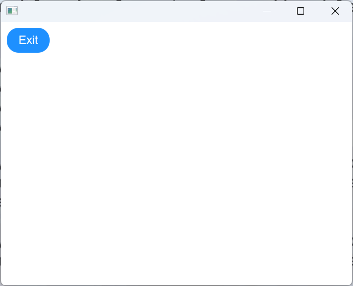
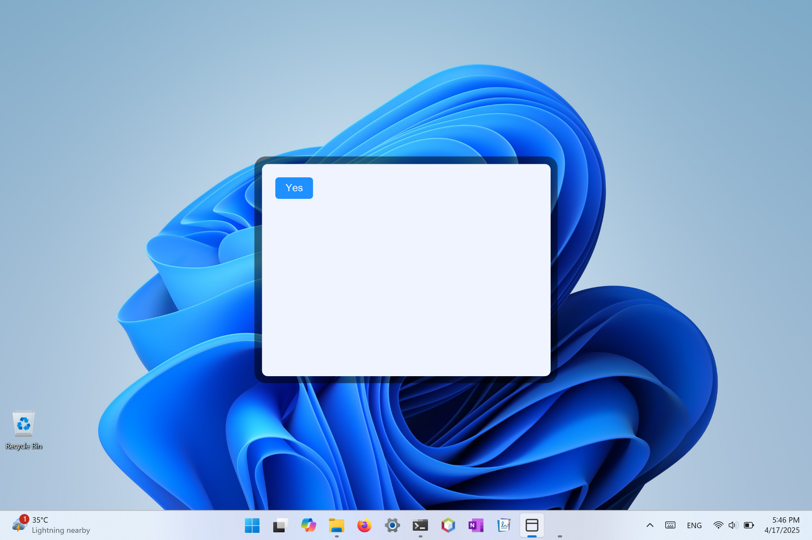
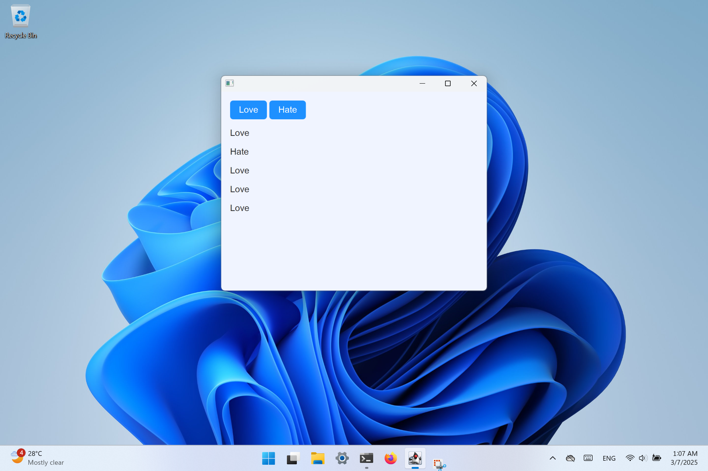
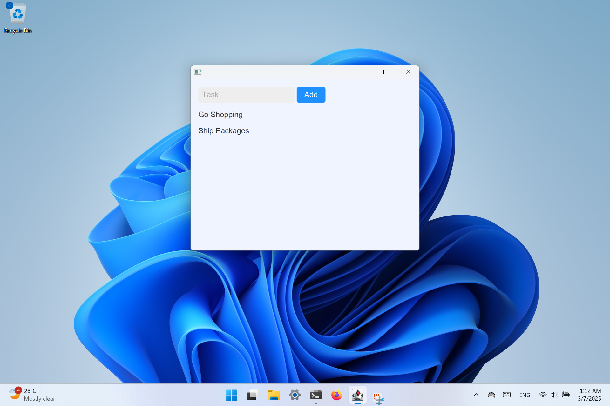
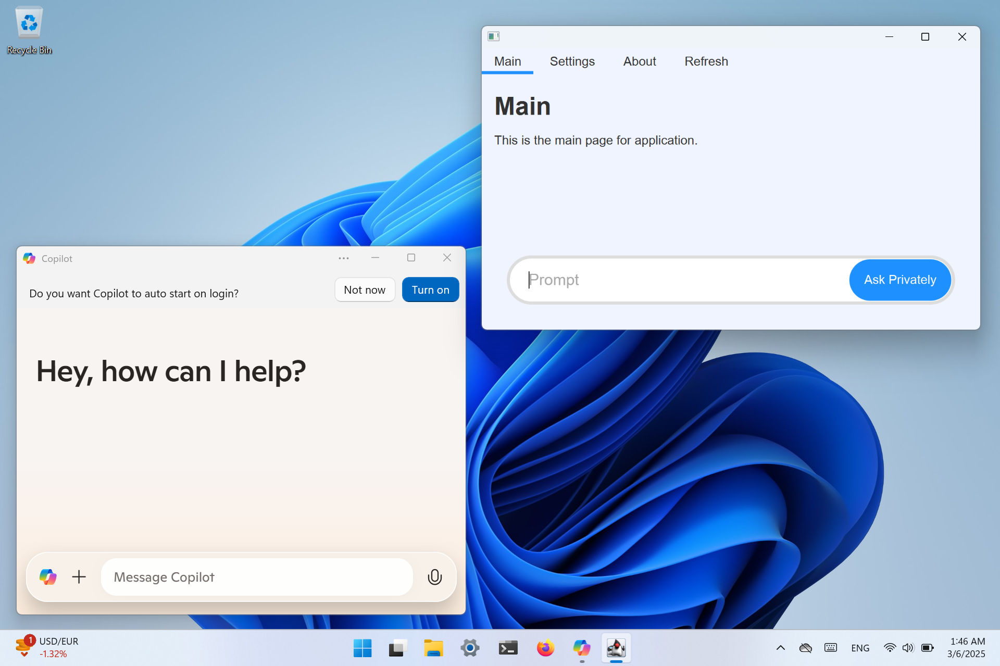

## The Starry Framework

The framework for writing modern Java desktop application.

Setting up on Windows
```
curl https://codestar.work/starry.bat | cmd
```

Setting up on Linux x64
```
curl https://codestar.work/starry-linux-x64.sh  | sh
```

Setting up on Linux a64
```
curl https://codestar.work/starry-linux-a64.sh  | sh
```

Setting up on macOS x64
```
curl https://codestar.work/starry-darwin-x64.sh | sh
```

Setting up on macOS a64
```
curl https://codestar.work/starry-darwin-a64.sh | sh
```

Simple App

```java
import starry.StarryApp;

public class Start extends StarryApp {
	
	public void main() {
		load("https://google.com");
	}

}
```


Command Line to build the project.
```
Windows:  make-windows.bat
Linux:    bash make-linux.sh
macOS:    bash make-darwin.sh
```

Event Handling

```java
import starry.StarryApp;
import javafx.application.Platform;
import org.w3c.dom.events.Event;

public class Start extends StarryApp {
	
	public void main() {
		loadContent(content);
	}
	
	public void setup() {
		setAction("sample-button", e -> exit(e) );
	}
	
	void exit(Event event) {
		Platform.exit();
	}
	
	String content = 
	"""
	<html>
		<head>
		</head>
		<body>
			<main>
				<button id="sample-button">Exit</button>
			</main>
		</body>
	</html>
	""";
}
```




Toggle Button

```java
import starry.StarryApp;
import javafx.application.Platform;
import org.w3c.dom.events.Event;
import org.w3c.dom.Element;

public class Start extends StarryApp {
	
	public void main() {
		loadContent(content);
	}
	
	public void setup() {
		setAction("sample-button", e -> change(e) );
	}
	
	void change(Event event) {
		Element element = (Element)event.getTarget();
		try {
			String current = element.getTextContent();
			String next = "Yes".equals(current) ? "No" : "Yes";
			element.setTextContent(next);
		} catch (Exception e) { }
	}
	
	String content = 
	"""
	<html>
		<head>
		</head>
		<body>
			<main>
				<button id="sample-button">Yes</button>
			</main>
		</body>
	</html>
	""";
}
```


Love Hate

```java
import starry.StarryApp;
import javafx.application.Platform;
import org.w3c.dom.Document;
import org.w3c.dom.Element;
import org.w3c.dom.events.Event;

public class Start extends StarryApp {
	
	public void main() {
		loadContent(content);
	}
	
	public void setup() {
		setAction("love-button", e -> add("Love") );
		setAction("hate-button", e -> add("Hate") );
	}
	
	void add(String message) {
		Document document = page.getEngine().getDocument();
		Element report = document.getElementById("report");
		
		Element item = document.createElement("p");
		try {
			item.setTextContent(message);
			report.appendChild(item);
		} catch (Exception e) { }
	}
	
	String content = 
	"""
	<html>
		<head>
		</head>
		<body>
			<main>
				<button id="love-button">Love</button>
				<button id="hate-button">Hate</button>
				<section id="report"></section>
			</main>
		</body>
		<style>
			#report { margin-top: 1rem; }
		</style>
	</html>
	""";
}
```


Todo Application
```java
import starry.StarryApp;
import org.w3c.dom.Element;
import org.w3c.dom.events.Event;
import org.w3c.dom.html.HTMLInputElement;

public class Start extends StarryApp {
	
	public void main() {
		loadContent(content);
	}
	
	public void setup() {
		setAction("add-button", e -> add() );
	}
	
	void add() {
		var input  = (HTMLInputElement)getElement("task");
		var report = getElement("report");
		var item   = createElement("p");
		try {
			item.setTextContent(input.getValue());
			report.appendChild(item);
		} catch (Exception e) { }
		input.setValue("");
	}
	
	String content = 
	"""
	<html>
		<head>
		</head>
		<body>
			<main>
            	<input id="task" placeholder="Task" />
            	<button id="add-button">Add</button>
            	<section id="report"></section>
			</main>
		</body>
		<style>
			#report { margin-top: 1rem; }
		</style>
	</html>
	""";
}
```


Switching Page
```java
import starry.StarryApp;

public class Start extends StarryApp {
	
	public void main() {
		loadContent(mainPage + style);
	}
	
	public void setup() {
		setAction("settings-button", e -> showSettings() );
		setAction("home-button", e -> showHome() );
	}
	
	void showSettings() {
		loadContent(settingsPage + style);
	}
	
	void showHome() {
		loadContent(mainPage + style);
	}

}
```

Modal Dialog
```java
	void showModalDialog() {
		WebView view = new WebView();
		VBox box = new VBox(view);
		Scene scene = new Scene(box, 360, 240);
		Stage dialog = new Stage();
		dialog.setScene(scene);
		dialog.initOwner(mainStage);
		dialog.initStyle(StageStyle.UNDECORATED);
		
		dialog.setIconified(false);
		dialog.setMaximized(false);
		dialog.setFullScreen(false);
		dialog.initModality(Modality.APPLICATION_MODAL);
		dialog.show();
		dialog.showAndWait();
	}
```

Refreshing Dynamically
```java
import starry.StarryApp;

public class Start extends StarryApp {
	
	public void main() {
		loadFile("code/main.html");
	}
	
	public void setup() {
		setAction("refresh", e -> main() );
	}
}
```




Common Framework Methods & Fields

```Java
public void setAction(event, handler)
public void load(String location)
public void loadContent(String content)
public void loadFile(String file)
public Element getElement(String identifier)
public Element createElement(String tag)

public WebView page;
public Stage mainStage;
public Scene mainScene;
```


Common Methods
```java

public interface Node {

	public String getNodeName();
	public String getNodeValue()
							  throws DOMException;
	public void setNodeValue(String nodeValue)
							  throws DOMException;
	public short getNodeType();
	public Node getParentNode();
	public NodeList getChildNodes();
	public Node getFirstChild();
	public Node getLastChild();
	public Node getPreviousSibling();
	public Node getNextSibling();
	public NamedNodeMap getAttributes();
	public Document getOwnerDocument();
	public Node insertBefore(Node newChild,
							Node refChild)
							throws DOMException;
	public Node replaceChild(Node newChild,
							Node oldChild)
							throws DOMException;
	public Node removeChild(Node oldChild)
							throws DOMException;
	public Node appendChild(Node newChild)
							throws DOMException;
	public boolean hasChildNodes();
	public Node cloneNode(boolean deep);
	public void normalize();
	public boolean isSupported(String feature,
							   String version);
	public String getNamespaceURI();
	public String getPrefix();
	public void setPrefix(String prefix)
							throws DOMException;
	public String getLocalName();
	public boolean hasAttributes();
	public String getBaseURI();
	public short compareDocumentPosition(Node other)
							throws DOMException;
	public String getTextContent()
							throws DOMException;
	public void setTextContent(String textContent)
							throws DOMException;
	public boolean isSameNode(Node other);
	public String lookupPrefix(String namespaceURI);
	public boolean isDefaultNamespace(String namespaceURI);
	public String lookupNamespaceURI(String prefix);
	public boolean isEqualNode(Node arg);
	public Object getFeature(
					String feature,
					String version);
	public Object setUserData(
					String key,
					Object data,
					UserDataHandler handler);
	public Object getUserData(String key);
}

public interface Element extends Node {

	public String getTagName();
	public String getAttribute(String name);
	public void setAttribute(
					String name,
					String value) throws DOMException;
	public void removeAttribute(String name) throws DOMException;
	public Attr getAttributeNode(String name);
	public Attr setAttributeNode(Attr newAttr) throws DOMException;
	public Attr removeAttributeNode(Attr oldAttr) throws DOMException;

	public NodeList getElementsByTagName(String name);
	public String getAttributeNS(
						String namespaceURI,
						String localName) throws DOMException;
	public void setAttributeNS(
						String namespaceURI,
						String qualifiedName,
						String value) throws DOMException;
	public void removeAttributeNS(
						String namespaceURI,
						String localName) throws DOMException;
	public Attr getAttributeNodeNS(
						String namespaceURI,
						String localName) throws DOMException;

	public Attr setAttributeNodeNS(Attr newAttr) throws DOMException;

	public NodeList getElementsByTagNameNS(
						String namespaceURI,
						String localName) throws DOMException;
	public boolean hasAttribute(String name);
	public boolean hasAttributeNS(
						String namespaceURI,
						String localName) throws DOMException;

	public TypeInfo getSchemaTypeInfo();

	public void setIdAttribute(
						String name,
						boolean isId) throws DOMException;

	public void setIdAttributeNS(
						String namespaceURI,
						String localName,
						boolean isId) throws DOMException;

	public void setIdAttributeNode(
						Attr idAttr,
						boolean isId) throws DOMException;
}

public interface Event {
	public String getType();
	public EventTarget getTarget();
	public EventTarget getCurrentTarget();
	public short getEventPhase();
	public boolean getBubbles();
	public boolean getCancelable();
	public long getTimeStamp();
	public void stopPropagation();
	public void preventDefault();

	public void initEvent(String eventTypeArg,
						boolean canBubbleArg,
						boolean cancelableArg);
}

public interface EventTarget {

	public void addEventListener(
					String type,
					EventListener listener,
					boolean useCapture);

	public void removeEventListener(
					String type,
					EventListener listener,
					boolean useCapture);

	public boolean 
	dispatchEvent(Event evt) throws EventException;
}
```
