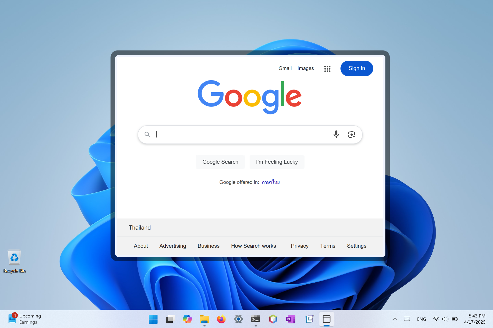
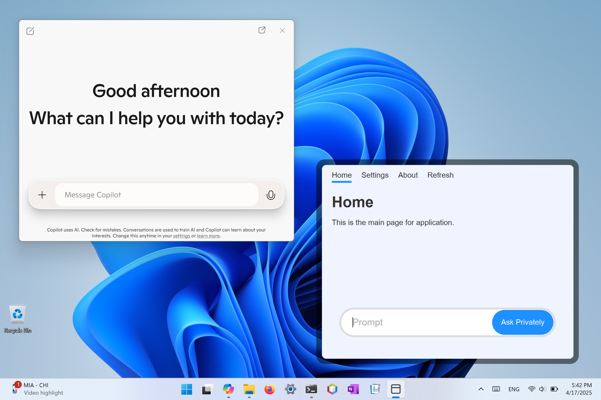

## The Starry Framework

The framework for writing modern Java desktop application.

Setting up on Windows
```
curl https://codestar.work/starry.bat | cmd
```

Setting up on Linux x64
```
curl https://codestar.work/starry-linux-x64.sh  | sh
```

Setting up on Linux a64
```
curl https://codestar.work/starry-linux-a64.sh  | sh
```

Setting up on macOS x64
```
curl https://codestar.work/starry-darwin-x64.sh | sh
```

Setting up on macOS a64
```
curl https://codestar.work/starry-darwin-a64.sh | sh
```

Simple App

```java
import starry.Starry;

public class Start {
	public static void main(String[] data) {
		Starry app = new Starry();
		app.loadURL("https://google.com");
	}
}
```



Command Line to build the project.
```
Windows:  make-windows.bat
Linux:    bash make-linux.sh
macOS:    bash make-darwin.sh
```

Event Handling

There are two ways to handle event:
- By Lambda Method 
- By Static Method

```java
// 1. Lambda Method
setAction("love-button", e -> showLove(e));

// 2. Static Method
setAction("love-button", Start::showLove);
```

Sample Code

```java
import starry.Starry;
import org.w3c.dom.events.Event;

public class Start {
	public static void main(String[] data) {
		new Start().run();
	}
	
	void run() {
		Starry app = new Starry();
		app.loadString(content);
		app.whenReady( () -> setup(app) );
	}
	void setup(Starry app) {
		app.setAction("sample-button", e -> exit(e) );
	}
	
	void exit(Event event) {
		System.exit(0);
	}

	String content = 
	"""
	<html>
		<head>
		</head>
		<body>
			<main>
				<button id="sample-button">Exit</button>
			</main>
		</body>
	</html>
	""";
}
```


Toggle Button

```java
import starry.Starry;
import org.w3c.dom.events.Event;
import org.w3c.dom.Element;

public class Start {
	public static void main(String[] data) {
		new Start().run();
	}
	
	void run() {
		Starry app = new Starry();
		app.loadString(content);
		app.whenReady( () -> setup(app) );
	}
	
	void setup(Starry app) {
		app.setAction("sample-button", e -> change(e) );
	}
	
	void change(Event event) {
		Element element = (Element)event.getTarget();
		try {
			String current = element.getTextContent();
			String next = "Yes".equals(current) ? "No" : "Yes";
			element.setTextContent(next);
		} catch (Exception e) { }
	}
	
	String content = 
	"""
	<html>
		<head>
		</head>
		<body>
			<main>
				<button id="sample-button">Yes</button>
			</main>
		</body>
	</html>
	""";
}
```


Love Hate

```java
import starry.Starry;
import org.w3c.dom.Element;

public class Start {
	public static void main(String[] data) {
		new Start().run();
	}
	
	void run() {
		Starry app = new Starry();
		app.loadString(content);
		app.whenReady( () -> setup(app) );
	}
	
	void setup(Starry app) {
		app.setAction("love-button", e -> add("Love", app) );
		app.setAction("hate-button", e -> add("Hate", app) );
	}
	
	void add(String message, Starry app) {
		Element report = app.getElement("report");
		
		Element item = app.createElement("p");
		try {
			item.setTextContent(message);
			report.appendChild(item);
		} catch (Exception e) { }
	}
	
	String content = 
	"""
	<html>
		<head>
		</head>
		<body>
			<main>
				<button id="love-button">Love</button>
				<button id="hate-button">Hate</button>
				<section id="report"></section>
			</main>
		</body>
		<style>
			#report { margin-top: 1rem; }
		</style>
	</html>
	""";
}
```


Todo Application
```java
import starry.Starry;
import org.w3c.dom.html.HTMLInputElement;

public class Start {
	public static void main(String[] data) {
		new Start().run();
	}
	
	Starry app = new Starry();
	
	void run() {
		app.loadString(content);
		app.whenReady( () -> setup() );
	}
	
	void setup() {
		app.setAction("add-button", e -> add() );
	}
	
	void add() {
		var input  = (HTMLInputElement)app.getElement("task");
		var report = app.getElement("report");
		var item   = app.createElement("p");
		item.setTextContent(input.getValue());
		report.appendChild(item);
		input.setValue("");
	}
	
	String content = 
	"""
	<html>
		<head>
		</head>
		<body>
			<main>
            	<input id="task" placeholder="Task" />
            	<button id="add-button">Add</button>
            	<section id="report"></section>
			</main>
		</body>
		<style>
			#report { margin-top: 1rem; }
		</style>
	</html>
	""";
}
```


Refreshing Dynamically (TODO: Update this code)
```java
import starry.StarryApp;

public class Start extends StarryApp {
	
	public void main() {
		loadFile("code/main.html");
	}
	
	public void setup() {
		setAction("refresh", e -> main() );
	}
}
```

Additional Sample Code
```
import starry.Starry;
import org.w3c.dom.events.Event;

public class Start {
	public static void main(String[] data) {
		Starry app = new Starry();
		app.loadFile("main.html");
		app.whenReady( () -> setup(app) );
	}

	static void setup(Starry app) {
		app.setAction("refresh", Start::showRefresh);
		app.setAction("love-button", e -> System.out.println("Love") );
		app.setAction("hate-button", e -> System.out.println("Hate") );

		String arch = System.getProperty("os.arch");
		System.out.println(arch);

		String os = System.getProperty("os.name");
		System.out.println(os);

		app.setText("report-arch", arch);
		app.setText("report-os", os);
	}
	
	static void showRefresh(Event e) {
		System.out.println("Refreshing");
	}
}
```




Common Framework Methods & Fields

```Java
public void setAction(event, handler)
public void load(String location)
public void loadContent(String content)
public void loadFile(String file)
public Element getElement(String identifier)
public Element createElement(String tag)

public WebView page;
public Stage mainStage;
public Scene mainScene;
```

## To Do

- Text Area

- Toggle as a switch

- Slider