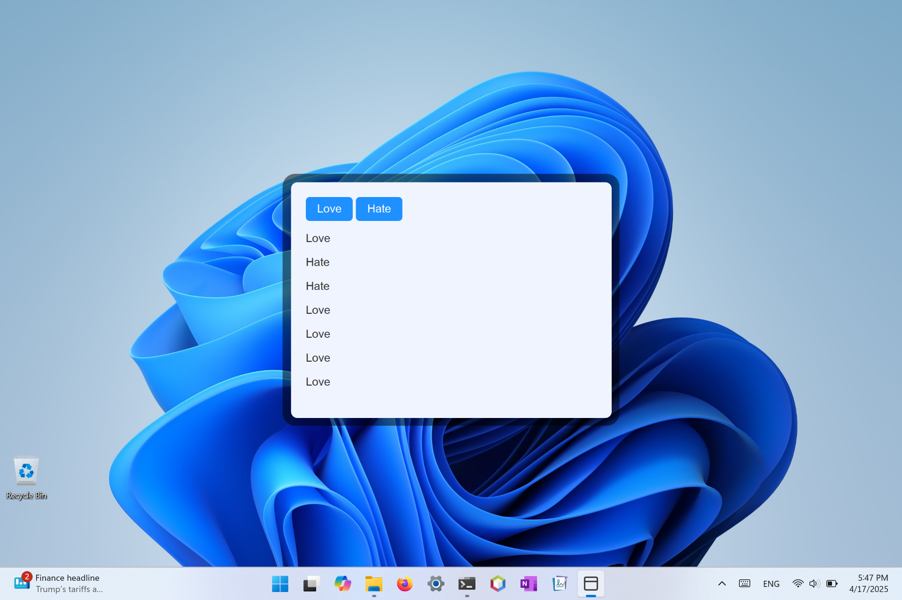
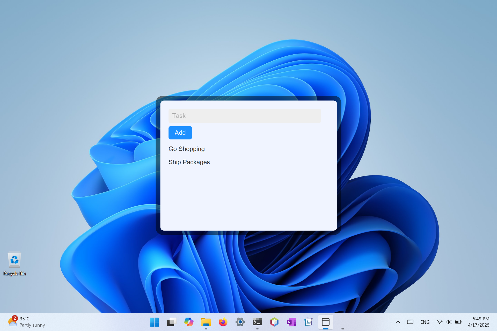

## The Starry Framework

The framework for writing modern Java desktop application.

Setting up on Windows
```
curl https://codestar.work/starry.bat | cmd
```

Setting up on Linux x64
```
curl https://codestar.work/starry-linux-x64.sh  | sh
```

Setting up on Linux a64
```
curl https://codestar.work/starry-linux-a64.sh  | sh
```

Setting up on macOS x64
```
curl https://codestar.work/starry-darwin-x64.sh | sh
```

Setting up on macOS a64
```
curl https://codestar.work/starry-darwin-a64.sh | sh
```

Simple App

```java
import starry.StarryApp;

public class Start extends StarryApp {
	
	public void main() {
		load("https://google.com");
	}

}
```


Command Line to build the project.
```
Windows:  make-windows.bat
Linux:    bash make-linux.sh
macOS:    bash make-darwin.sh
```

Event Handling

There are two ways to handle event:
- By Lambda Method 
- By Static Method

```java
// 1. Lambda Method
setAction("love-button", e -> showLove(e));

// 2. Static Method
setAction("love-button", Start::showLove);
```

Sample Code

```java
import starry.StarryApp;
import javafx.application.Platform;
import org.w3c.dom.events.Event;

public class Start extends StarryApp {
	
	public void main() {
		loadContent(content);
	}
	
	public void setup() {
		setAction("sample-button", e -> exit(e) );
	}
	
	void exit(Event event) {
		Platform.exit();
	}
	
	String content = 
	"""
	<html>
		<head>
		</head>
		<body>
			<main>
				<button id="sample-button">Exit</button>
			</main>
		</body>
	</html>
	""";
}
```


Toggle Button

```java
import starry.StarryApp;
import javafx.application.Platform;
import org.w3c.dom.events.Event;
import org.w3c.dom.Element;

public class Start extends StarryApp {
	
	public void main() {
		loadContent(content);
	}
	
	public void setup() {
		setAction("sample-button", e -> change(e) );
	}
	
	void change(Event event) {
		Element element = (Element)event.getTarget();
		try {
			String current = element.getTextContent();
			String next = "Yes".equals(current) ? "No" : "Yes";
			element.setTextContent(next);
		} catch (Exception e) { }
	}
	
	String content = 
	"""
	<html>
		<head>
		</head>
		<body>
			<main>
				<button id="sample-button">Yes</button>
			</main>
		</body>
	</html>
	""";
}
```


Love Hate

```java
import starry.StarryApp;
import javafx.application.Platform;
import org.w3c.dom.Document;
import org.w3c.dom.Element;
import org.w3c.dom.events.Event;

public class Start extends StarryApp {
	
	public void main() {
		loadContent(content);
	}
	
	public void setup() {
		setAction("love-button", e -> add("Love") );
		setAction("hate-button", e -> add("Hate") );
	}
	
	void add(String message) {
		Document document = page.getEngine().getDocument();
		Element report = document.getElementById("report");
		
		Element item = document.createElement("p");
		try {
			item.setTextContent(message);
			report.appendChild(item);
		} catch (Exception e) { }
	}
	
	String content = 
	"""
	<html>
		<head>
		</head>
		<body>
			<main>
				<button id="love-button">Love</button>
				<button id="hate-button">Hate</button>
				<section id="report"></section>
			</main>
		</body>
		<style>
			#report { margin-top: 1rem; }
		</style>
	</html>
	""";
}
```


Todo Application
```java
import starry.StarryApp;
import org.w3c.dom.Element;
import org.w3c.dom.events.Event;
import org.w3c.dom.html.HTMLInputElement;

public class Start extends StarryApp {
	
	public void main() {
		loadContent(content);
	}
	
	public void setup() {
		setAction("add-button", e -> add() );
	}
	
	void add() {
		var input  = (HTMLInputElement)getElement("task");
		var report = getElement("report");
		var item   = createElement("p");
		try {
			item.setTextContent(input.getValue());
			report.appendChild(item);
		} catch (Exception e) { }
		input.setValue("");
	}
	
	String content = 
	"""
	<html>
		<head>
		</head>
		<body>
			<main>
            	<input id="task" placeholder="Task" />
            	<button id="add-button">Add</button>
            	<section id="report"></section>
			</main>
		</body>
		<style>
			#report { margin-top: 1rem; }
		</style>
	</html>
	""";
}
```


Refreshing Dynamically
```java
import starry.StarryApp;

public class Start extends StarryApp {
	
	public void main() {
		loadFile("code/main.html");
	}
	
	public void setup() {
		setAction("refresh", e -> main() );
	}
}
```


Common Framework Methods & Fields

```Java
public void setAction(event, handler)
public void load(String location)
public void loadContent(String content)
public void loadFile(String file)
public Element getElement(String identifier)
public Element createElement(String tag)

public WebView page;
public Stage mainStage;
public Scene mainScene;
```

## To Do

- Text Area

- Toggle as a switch

- Slider